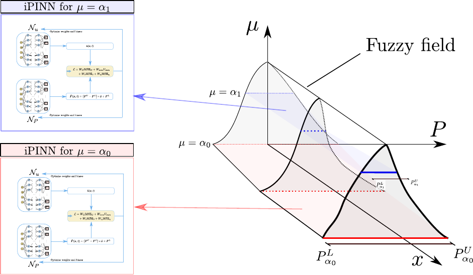
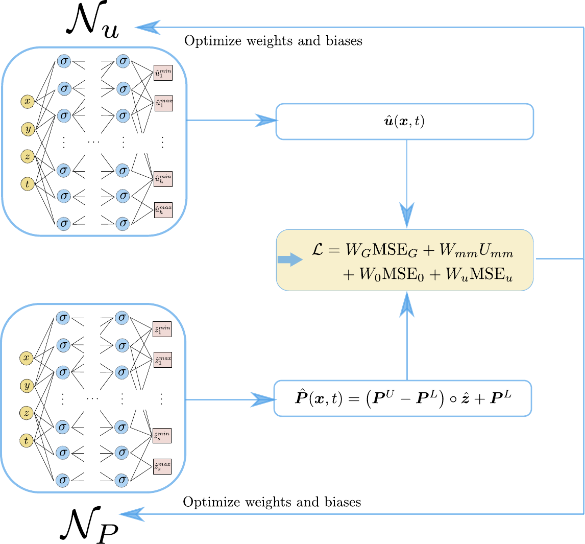

# Interval and fuzzy physics-informed neural networks for uncertain fields

  - Author: Jan N Fuhg
  - Organization: Cornell University

Here, we propose a physics-informed neural network approach to solve interval and fuzzy partial differential equations[1]. In contrast to finite element approaches, no correlation length specification of the input fields as well as no Monte-Carlo simulations
are necessary. In fact, information about the input interval fields is obtained
directly as a byproduct of the presented solution scheme. Furthermore, all
major advantages of PINNs are retained, i.e. meshfree nature of the scheme,
and ease of inverse problem set-up

<p align="center">

</p>
<p>
    <em>image_caption</em>
</p>

<p align="center">

</p>


## Installation
This code requires an [Anaconda](https://www.anaconda.com/products/individual) or [Miniconda](https://docs.conda.io/en/latest/miniconda.html) environment with a recent Python version.
The complete repository can be cloned and installed locally. It is recommended to create a conda environment before installation. This can be done by the following the command line instructions

```
$ git clone https://github.com/FuhgJan/intervalAndFuzzyPINN.git ./intervalAndFuzzyPINN
$ cd intervalAndFuzzyPINN
$ conda env create -f environment.yml
$ conda activate intervalAndFuzzyPINN
$ python -m pip install . --user

```
The provided example can then be run with

```
$ python3 run_hole_problem.py
```

Outputs will be written to mixedDEM/outputs/vtk_files/ and can be opened with paraview.

The conda environment can be closed with
```
$ conda deactivate
```
The conda environment can be deleted with
```
$ conda env remove --name intervalAndFuzzyPINN
```


## Dependencies

The code requires the following packages as imports:

 - [NumPy](http://numpy.scipy.org) for array handling
 - [Scipy](https://www.scipy.org/) for numerical solutions
 - [torch](https://pytorch.org/) for the neural network and automatic differentiation libraries
 - [MatPlotLib](https://matplotlib.org/) for graphical output


## References
If you use part of this code consider citing:

[1] Jan N. Fuhg and Ioannis Kalogeris and Amélie Fau and Nikolaos Bouklas. "Interval and fuzzy physics-informed neural networks for uncertain fields".
Probabilistic Engineering Mechanics (2022): 103240


## License

This package comes with ABSOLUTELY NO WARRANTY. This is free
software, and you are welcome to redistribute it under the conditions of
the GNU General Public License
([GPLv3](http://www.fsf.org/licensing/licenses/gpl.html))

The contents are published under the 
Creative Commons Attribution-NonCommercial-ShareAlike 4.0 International License
([CC BY-NC-SA 4.0](http://creativecommons.org/licenses/by-nc-sa/4.0/))
